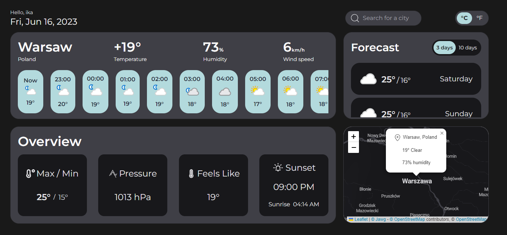

# Weather APP built with React / Tailwind

Link to live demo: https://sensational-cupcake-3020bd.netlify.app

# Technologies used:
- VITE/REACT
- TYPESCRIPT
- TAILWINDCSS
- REACT QUERY
- REACT ROUTER
- FRAMER MOTION
- LEAFLET MAPS

# Features:
- Current weather
- 24h forecast
- 3/10 days forecast
- °C/°F toggle
- map for current location

